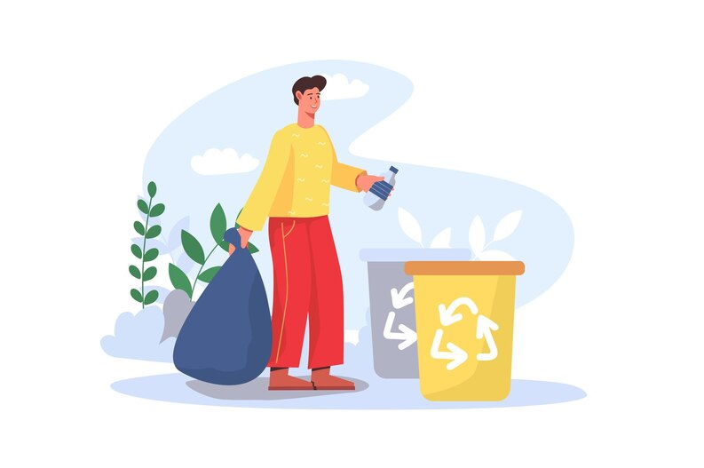

# Meena Plastic Website



## 🌱 About The Project

A modern, responsive website for Meena Plastic - a leading manufacturer of eco-friendly plastic products based in Vadodara, Gujarat. This website showcases their commitment to sustainability while displaying their product range including compostable trash bags, biodegradable waste bags, and scented trash bags.

## ✨ Features

- **Responsive Design:** Works seamlessly across desktop and mobile devices
- **Modern UI:** Clean interface with intuitive navigation
- **Product Showcase:** Highlights the company's sustainable product line
- **Brand Storytelling:** Communicates the brand's mission and values

## 🛠️ Built With

- HTML5
- CSS3
- [Boxicons](https://boxicons.com/) - High quality web icons
- [Google Fonts](https://fonts.google.com/) - Poppins font family

## 🔍 Preview

The website includes:
- Navigation bar with company branding
- Hero section with mission statement
- Products showcase with images and pricing
- About Us section highlighting company values
- Footer with contact information and social links

## 🚀 Getting Started

To view the website locally:

1. Clone the repository
   ```
   git clone https://github.com/Lagadnakul/Meena-plastic-redesign-website.git
   ```
2. Open `index.html` in your browser

## 📝 License

Distributed under the MIT License. See `LICENSE` for more information.

## 📞 Contact

Meena Plastic - meenaplastic@gmail.com

Project Link: [https://github.com/Lagadnakul/Meena-plastic-redesign-website](https://github.com/Lagadnakul/Meena-plastic-redesign-website)